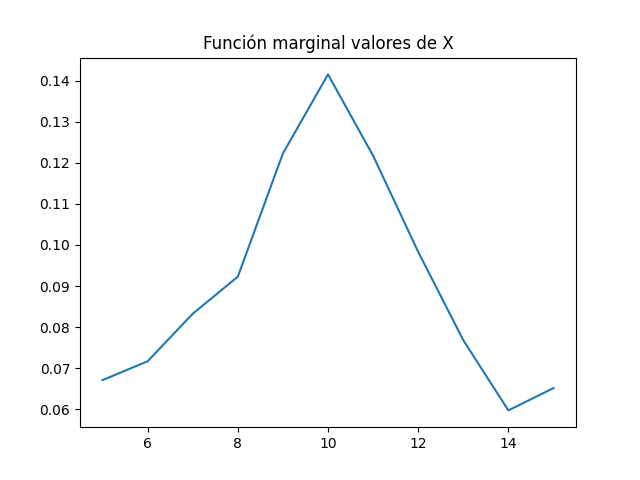
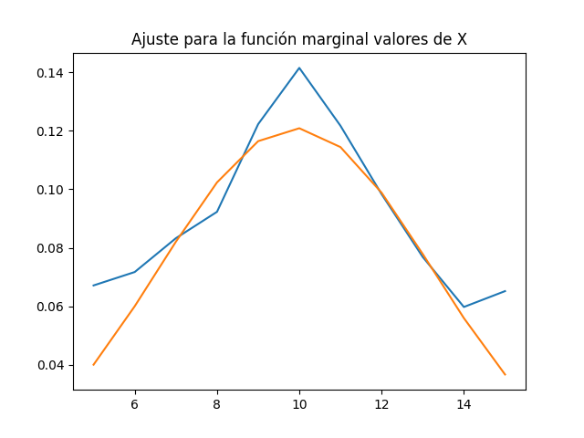
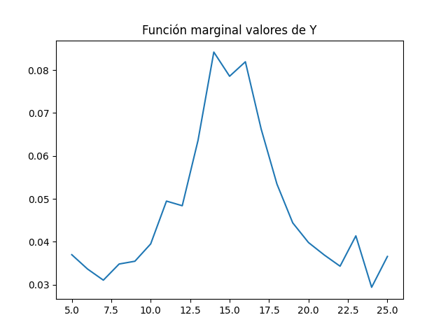
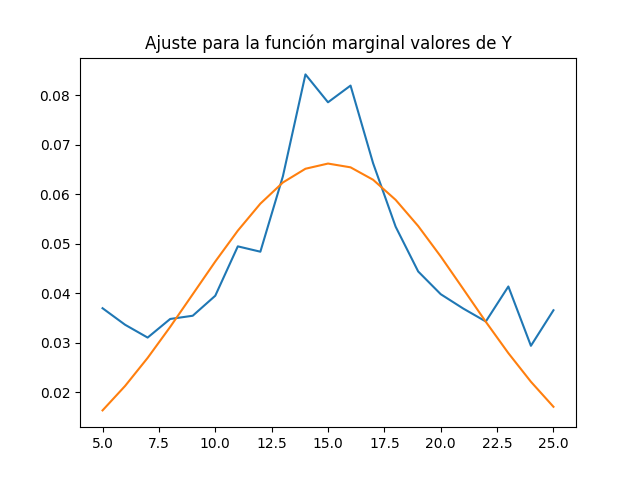
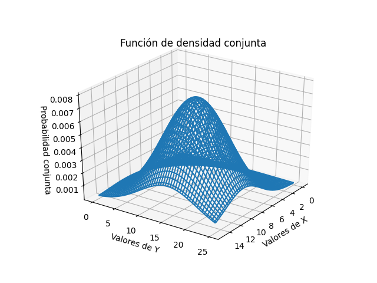

# tarea3_modelos
Estudiante: Joseline Sánchez Solís 
Carnet: B77127
En este trabajo se estudian temas relacionados a las variables aleatoria múltiples.

Para el punto 1 se calcula la curva de ajuste para la función marginal de X y Y. En el 
caso de X, los datos ruidosos tienen el siguiente comportamiento:

El comportamiento se asemeja a una campana gaussiana por lo que en la siguiente 
imagen se observa el ajuste.

Lo mismo se realizó a Y:

Para el punto 2 se utilizan los parámetros calculados en el punto 1. De manera que 
que la función marginal de X es:

    1/np.sqrt(2*np.pi*3.2994**2)*n.exp(-(x-9.9048)**2/(2*3.2994**2))
    
Mientras que la de Y es:
    
    1/np.sqrt(2*np.pi*6.0269**2)*np.exp(-(x-15.079)**2/(2*6.0269**2))

Si se considera que X y Y son independiente entonces estas dos funciones pueden multiplicarse
para conseguir la función de densidad marginal, y se consigue lo siguiente:

    1/(2*np.pi*19.88))*np.exp(-(X-9.905)**2/21.767 -(Y-15.08)**2/72.65
    
Esta función se utiliza como eje z para el plot de la gráfica 3D, la cual se comporta de la siguiente manera.

A continuación se describen algunos conceptos importantes:
*Correlación* Indica la fuerza y la dirección de una relación lineal y proporcionalidad entre 
dos variables estadísticas. Esto quiere decir que al hacer un cambio en una de las variables
la otra también debe cambiar. El "coeficiende de Pearson/Correlación" muestra esto, si se 
observan los resultados, se nota que este valor es pequeño, lo cual tiene sentido ya que para
realizar los cálculos se consideró a las variables como independientes. La *covarianza* también 
permite conocer el comportamiento de la dependencia, ya que  indica el grado de variación conjunta
de dos variables aleatorias respecto a sus medias. En el caso de los resultados, la covarianza
presenta un valor cercano a 0, por lo que se sigue confirmando la idependencia.
